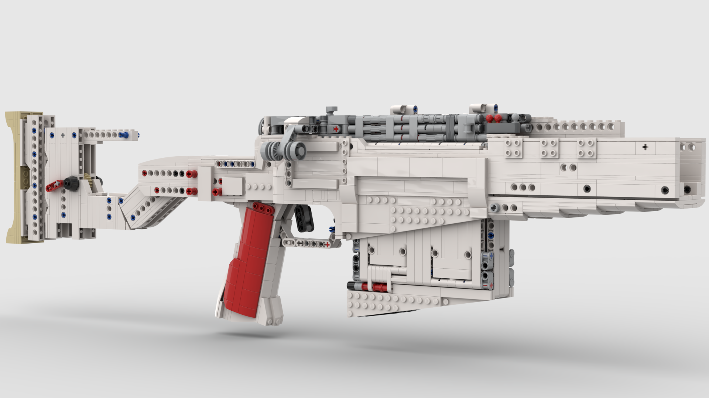

# AX50
AX-50 Accuracy International

## Features :
- shooting 
- shell ejection 
- detachable magazine 
- safety 
- recoil (**can NOT be ajusted**, can be disabled) 
- adjustable stock :
  - ~~cheek pad~~ (not yet)
  - length
- "field strip"
 

## Work In Progress :
Studio Model will be updated as I work on it. The sniper is basically done mechanism-wise, I still need to improve it looks-wise.

## Roadmap :
IRL : 
Finishing the barrel.
smoothing/removing as much visible technic holes/studs as possible.

STUDIO : 
Model the recoil mechanism
Model the roof
Model the barrel
Instructions (I may not bother with them soon, the model is technically everything you need.)

## Improvements/ToDoList :

- Picatinny rail for attachements on the roof(/barrel), I feel like we have space. [Akatuki918](https://www.youtube.com/@akatuki918/videos) has been making some work on it, I don't know how the mechanism could be adapted but it's some sort of proof of concept. 

- Find a better attachment for the bipod (or picatinny rail on the barrel too?).

- Cheek pad (cause now it's only a shoulder pad), but I never managed to keep the stock 3 studs wide with the axles to tweak a cheek pad. Maybe it'll have to be fixed in place, or the stock can be reworked into a 4 studs wide (but I'm too lazy to do that).

- Better rubberband placement for the shoulderpad return after adjusting the stock. 

- Make the recoil even better, the ejection even smoother blah blah blah as ususal.

- Improve the safety mechanism, it can be bypassed by pressing very hard on the trigger.

- Find a better recoil mechanism (the part that lets the barrel return in place, I'm pretty happy with the geared motion inverter.)

## Current progress on the studio model :
it's in white so I don't break my eyes, I'll distribute two versions anyway (one with normal colors, one with easy to see colors to better understand the mechanism.)

## Additional notes : 
The recoil can be disabled by adding a pin on the side. It's not practical and not meant to be toggled on and off repeteadly. 

This model uses supermarket rubberbands (from Carrefour in France, they're bad), as long as some regular loom bands for the mechanism. This model does not require specific brand, nor precise size. Any regular or small bands should do it.

## Credits :
This Sniper is build by me, over the course of, as of today, 1 year.

The shell design and the firing pin mechanism were brough to me by [GaryVR](https://wwdw.youtube.com/@GaryVR/videos) with his SESR Mk2 (he's the first I saw using them and explaing the mechanism with a tutorial). Then a few others such as [LegoBuildChannel](https://www.youtube.com/@LegoBuildChannel) or [SHRAPNEL](https://www.youtube.com/@SHRAPNEL_LEGO) popularized and perfected them.

The contraption to get the arch piece next to the trigger at the perfect height was achieved with the help of `lucahermann` and `zachpieces` on bricksculpt's discord server.

The mere idea of making this model of sniper comes from Resh's animation ["Crimson Alpine"](https://youtu.be/FZSkFLJx4fE?si=JUzZFpA46qbGeC0T) (it's peak).

`Mathias_456` Helped me with the recoil mechanism's concept.

The magazine comes from a scrap project of a bullpup sniper. 

## Disclaimer / Legal notes :

This custom LEGO® model design of the Accuracy International AX-50 was created by Joss_Lain. This work is licensed under a Creative Commons Attribution-NonCommercial-ShareAlike 4.0 International License (CC BY-NC-SA 4.0).

You are completely free to download, use, share, and modify this design. Simply apply the rule set :

> NON-COMMERCIAL USE. This design is strictly for personal and individual use. You may not use this material for commercial purposes or sell it, it's modifications or anything related to it. If you remix, transform, or build upon this design, you must distribute your contributions for free under the exact same license.

> Don't forget to credit the original author of this piece.

> I am not affiliated with, sponsored by, or endorsed by Accuracy International, any firearm or aftermarket parts manufacturers, or The LEGO Group. LEGO® is a trademark of the LEGO Group of companies, which does not sponsor, authorize, or endorse this project.
